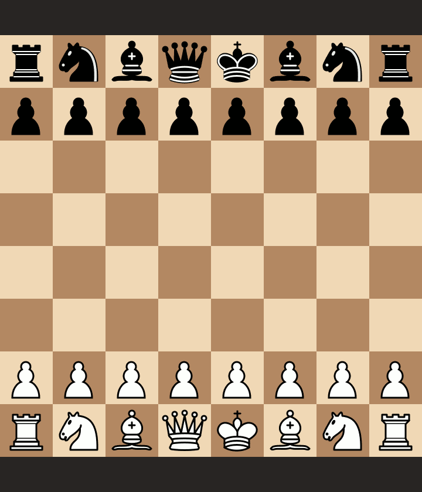

# chess-learning
This package provides a clean framework for amateurs to build chess models using big data, and experiment with different ML and AI strategies for predicting and winning chess games. Included is a pipeline for training ML models from millions or more of chess games (hundreds of millions of positions) with batch learning, a module with lots of methods for analyzing a chess board, an AI class for automated chess playing, and a script for playing against these models in command line.

Using a scalable ML pipeline designed for learning from chess games, this package can train predictive models with millions of chess games or more. This is because of the batch learning approach that the pipeline uses when training ML classifiers. Holding hundreds of millions of positions in memory at once is very likely to cause performance issues for a standard computer, including memory overflow and model crashing. Chess-learning has successfully trained ML models with  millions of expert chess games in less than a day.

Chess-learning builds classifiers that can continually learn from new chess game data after they're built--allowing for ongoing training and improvement. Model testing, validation and grid search are available features as well. Here's a game played by one of our chess models (playing as Black) against a 1500 ELO player. 


Below is a screenshot showing the gameplay's UI and visuals during a scholar's mate.  


## Table of Contents 
- [Installation](#installation)
- [Features](#features)
- [Support](#support)

## Installation 

### Clone
You can clone this repository by using the following link: https://github.com/camjohn47/chess-learning. 

### Prerequisites and Setup
You'll need the following Python modules in order to run all three modules: 
* numpy
* sklearn
* python-chess

Once all of these modules are installed, you can run any of the programs from within their directory. You can install these packages by using pip install on the requirements.txt file: 
```
pip install -r requirements.txt
```

## Features
### Learning from big data
You can train a classifier to predict the outcome of a chess game with just a few lines of code. First, you'll need some [PGN](https://en.wikipedia.org/wiki/Portable_Game_Notation) files containing lots of chess games. Ideally, at least hundreds of thousands of chess games, in order to ensure that the training data is sufficiently large and diverse. You can download 10's of millions of games in a single PGN file through the [Lichess Database](https://database.lichess.org/).

Next, you'll want to build batches of features and outputs to train your model with. Here's an example.
```python
from chesspipeline import ChessPipeline

# Path that the pipeline will use for saving/loading its ML model. 
model_path = 'chess_rfc_example.data'
pipeline = ChessPipeline(model_path)

# Build batches of training data that will be saved in <train_batch_dir>.
train_batch_dir = 'train_batches'
num_batch_files = 40
batch_size = int(1.0e5)
train_dir = 'train_pgns'
max_batches = 10
reset_batches = False
pipeline.build_batches(train_dir, train_batch_dir, num_batch_files, reset_batches,
					   batch_size, max_batches)
```

Note that if you want to use custom features, you'll have to change the ```get_features``` method in the ```chess_features``` module to include them. Note that all programs in this package use the ```python-chess``` board to represent chess positions, so any custom features should be designed with this in mind. 

Before training your classifier, you might want to do a grid search to find the best hyperparameters for your classifier. For example, if training a random forest classifier, you may want to experiment with different ```max_features``` and ```max_depth``` values before training your model. To do this, choose a training pgn directory (containing pgn files used for training) ```train_dir```, a testing pgn directory ```test_dir``` (containing pgn files used for testing), and a dictionary ```param_grid``` that has the same structure as it does in sklearn: [GridSearchCV](https://scikit-learn.org/stable/modules/generated/sklearn.model_selection.GridSearchCV.html). Here's an example.

```python
# Grid search over different values for different random forest hyperparameters.
param_grid = {'max_depth': [40, 80], 'min_samples_leaf': [100, 1000]}
batch_sizes = [int(x) for x in [1.0e5, 1.0e6]]
grid_results = pipeline.grid_search(train_batch_dir, test_batch_dir, param_grid, 
								    batch_sizes, max_train_batches=2, max_test_batches=1)
opt_params, opt_batch_size, _ = grid_results[0]
pipeline.update_model_params(opt_params)
```

You can train an ML classifier to predict chess game outcomces with just one line of code. 
```python
pipeline.batch_learning(train_batch_dir, opt_batch_size)
```

Two different families of models are currently available: [random forest](https://scikit-learn.org/stable/modules/generated/sklearn.ensemble.RandomForestClassifier.html) and all of sklearn's [SGD classifiers](https://scikit-learn.org/stable/modules/generated/sklearn.linear_model.SGDClassifier.html). Any model capable of batch learning is valid for the pipeline's design. This means that any model whose learning algorithm can be broken down into iterative parts can be trained with the Chess Pipeline. 

For example, logistic regression is great for batch learning, because its learning algorithm can be easily broken down into parametric updates that need only one training sample at a time. Unfortunately, logistic regression is also a linear model (GLM) that is far too simple to capture many of the nonlinearities in chess patterns. On the other hand, a decision tree is not well-suited for batch learning, because the standard decision tree learning algorithms require the entire training dataset during training. There's no straightforward, widely accepted way of incremental learning with a decision tree. Decision trees can still be trained with this pipeline, but not with batch learning. 

### Play against your engine
A Python interface for directly playing chess in Terminal. When playing chess games with the ```play.py``` script, opponent game play comes from an instance of ```ChessAI```. You can use this to test ML models built from a chess pipeline, test chess heuristics (for example, using heuristics or a ML model trained with ```ChessPipeline```), or just play against your engine for fun. 

Because opponent play is calculated from the ```ChessAI``` class, its moves are optimal given whatever evaluation function you give it. The game and AI classes are suitable for testing different evaluations, heuristics, models, strategies, etc.... Some parts of the ```ChessAI``` class are applicable beyond chess, such as its alpha beta algorithm, which can be used to find optimal moves for any zero-sum two person game (with some minor code changes). 

## Support
If you have any questions or feedback, please post an issue or email curiouscalvinj@gmail.com.
